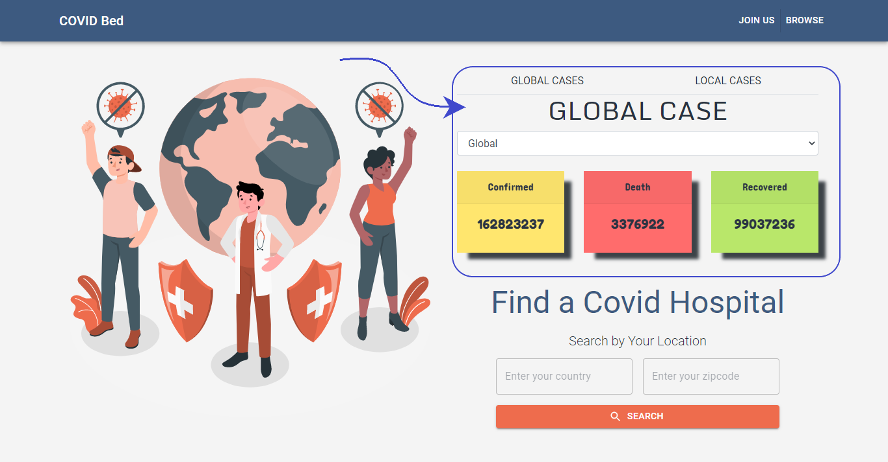
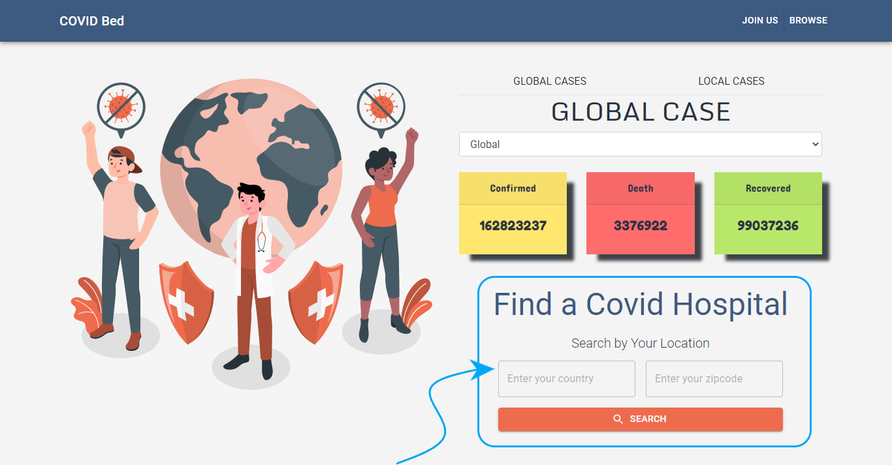
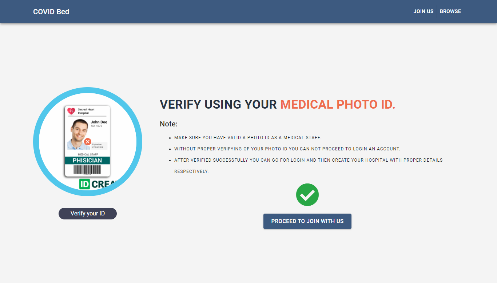
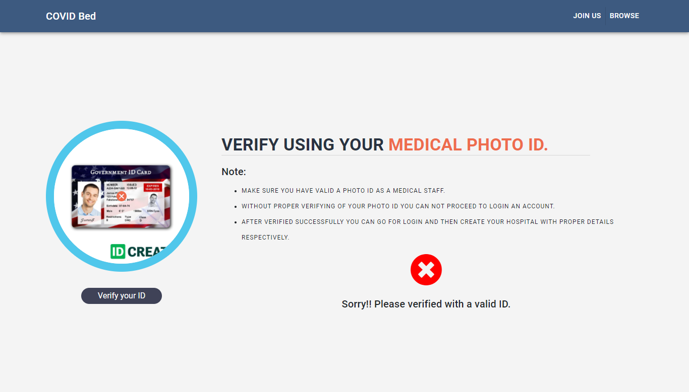
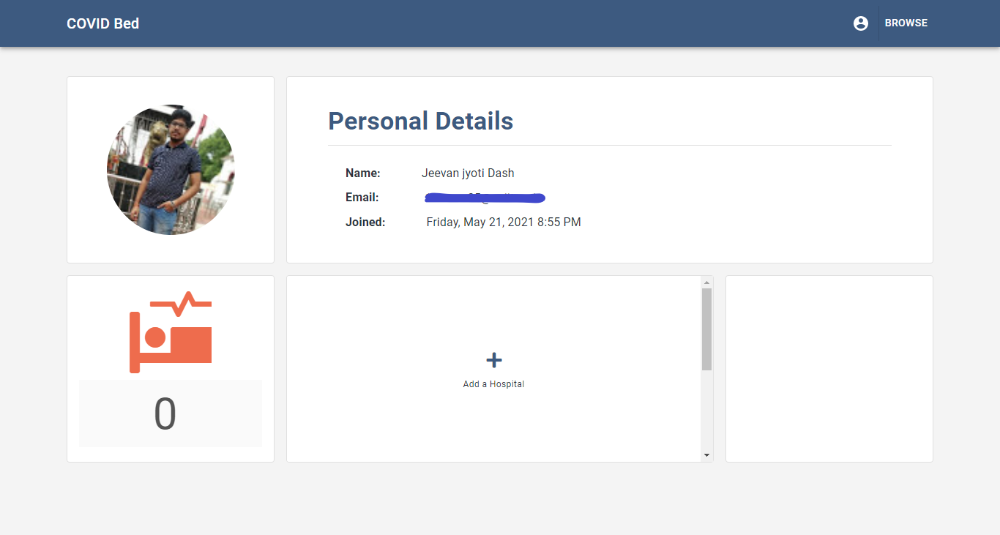
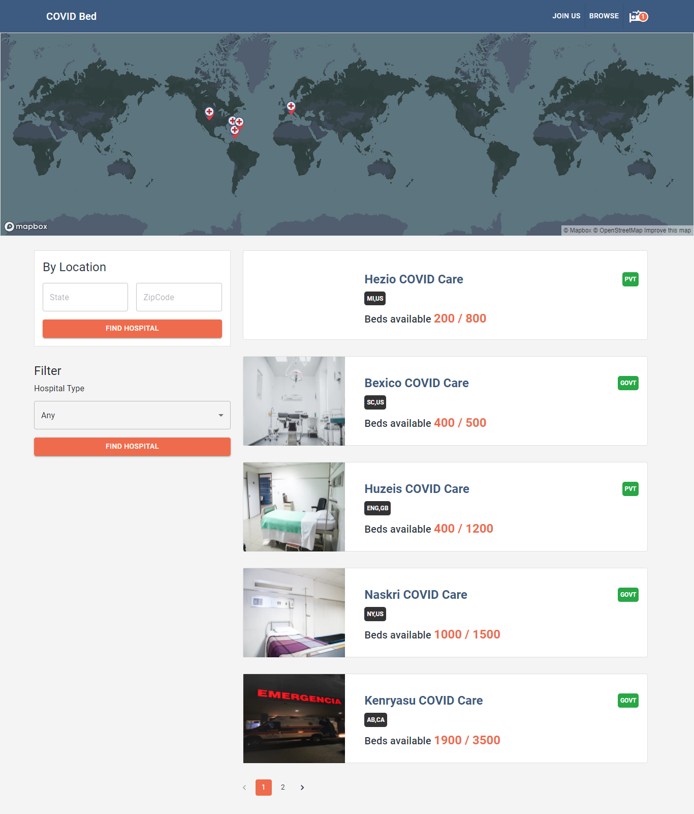
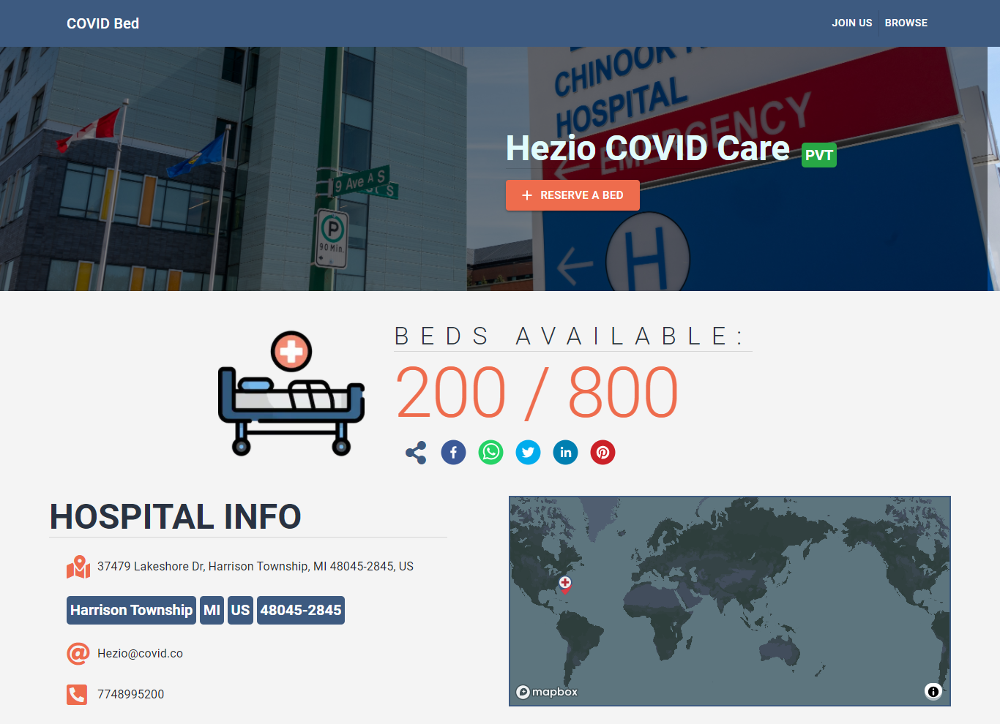
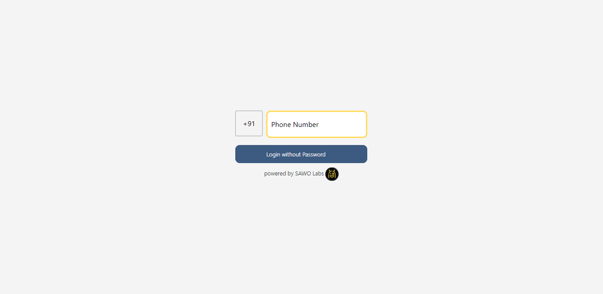
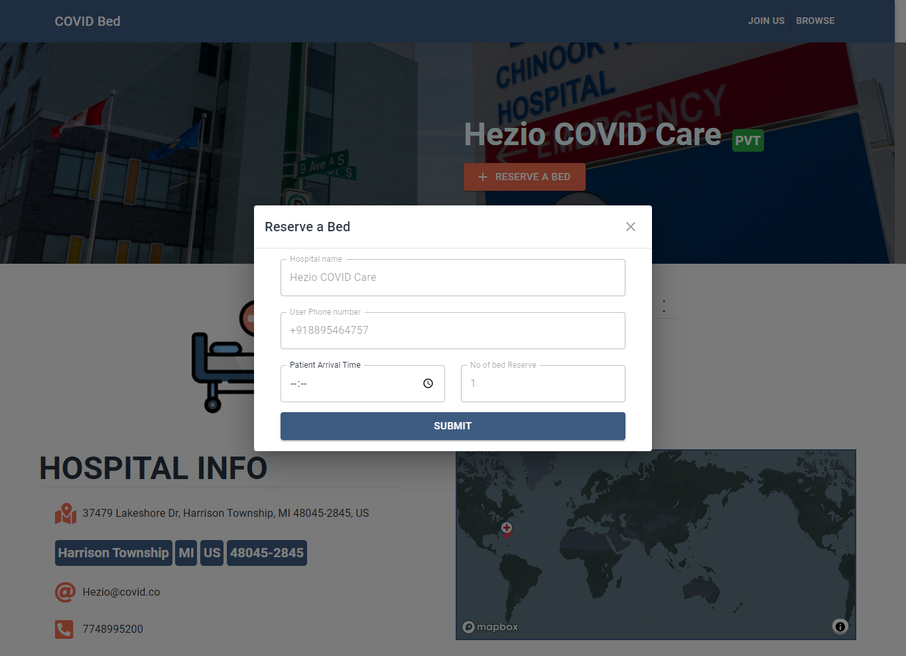
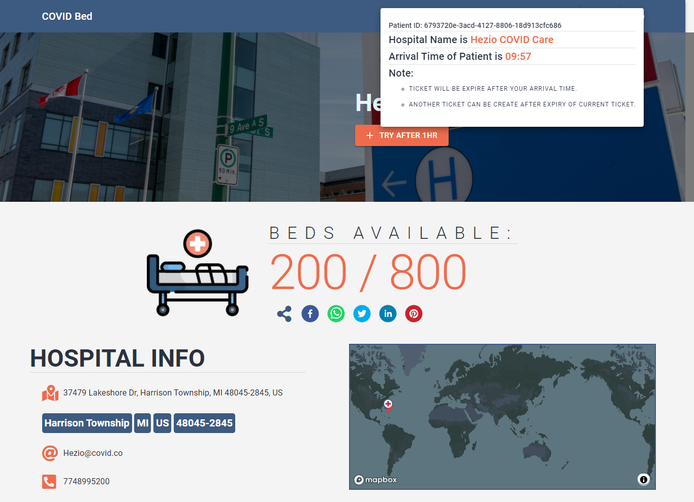

# COVID-BEDS

## 1. Idea of the project:

- Now a days our whole `world` is suffering from `Corona Virus`. Countries like `India, USA, Brazil, UK etc.` `Corona virus` is spreading vastly in most of their states.
- As for now considering `India` one of the major problem is states in `India` like `Uttar Pradesh, Maharashtra, Karnataka, Kerala, Odisha, Delhi(NCR) etc.` people are not even getting a `bed` in `hospital` for their proper treatment, for which many of them loose their lives.
- So, to solve this problem I have built this platform in which any `hospitals` can register their details properly and update their current `beds` available in a regular time format, so that any user can get the idea how many beds available in his/her nearest `hospitals` at any moment of time.

> Use Case of the project.

- Landing page of the website contains two main things.

  1. Corona Virus tracker for both country wise an state wise. I have implemented this part using `react-microfrontend architecture`.

  

  2. Any user can search Covid Cares using their respective location as well.

  

- If you want to join your `hospital` then go to `JOIN US` link, then your `hospital staff` should have a proper `Hospital PhotoID` to verify himself/herself as `valid hospital staff`.



If the user is not verified successfully then he/she can not proceed to register himself/herself.



`Note: For Join Us link usecase I have uploaded two image files named as doctor-id.png and not-doctor-id.jpg inside github-demo folder.`

After successfully login you can go to your profile page for register your hospital details.



> Then you can add or update your details according to your use case.

- If you want to browse all the hospitals or search by your location then you can proceed with `BROWSE` link.



- For other pages you can visit this link [https://covid-beds.vercel.app/](https://covid-beds.vercel.app/) as well.

- If you want to `reserve` a bed in any of the hospital then click on any `hospital link` for more details.



Then click on the `RESERVE A BED` button for proceed further.



Make sure you should verify your phone number using your `OTP` code successfully.
AFter verified successfully you will be redirect to your previous page and then give your `Patient Arrival` time appropriately.

`Note: Your patient arrival time interval must be 45mins to 1hr from current time.`



AFter successfully reserve a bed you can see your ticket like this. (If its not available then refresh your browser.)



`Note: This is a one side ticket generating. One user can create only one tiket at a time and after 1 hr the ticket will be automatically remove from user browser as well.`

## 2. Tech Stack:

- This is a [Next.js](https://nextjs.org/) project bootstrapped with [`create-next-app`](https://github.com/vercel/next.js/tree/canary/packages/create-next-app) and [Typescript](https://nextjs.org/docs/basic-features/typescript).
- For `API` I have used [Next.js API routes](https://nextjs.org/docs/api-routes/introduction) with [Prisma ORM](https://www.prisma.io/docs/).
- For `Styling` I have used [Material-UI](https://material-ui.com/).
- Last but not the list For `Deployement` I have used [Vercel](https://vercel.com/dashboard).

## 3. Setup Project in your Local system.

### Getting Started

First, install all the required modules:

```bash
npm install
```

`Note- Make sure you have also installed eslint and prettier extension for better coding experience.`

Second create a file named as `dev.db` inside `prisma` folder and edit inside `prisma/schema.prisma` file as mentioned below

```bash
datasource db {
  provider = "sqlite"
  url      = "file:./dev.db"
```

Then create a `.env.development.local` file in the root of the `project`.

` I have also added all the required API keys inside .env.development.local file.`

```bash
CLIENT_ID=***** your google auth client id
CLIENT_SECRET=***** your google auth client secret
AUTH0_CLIENT_ID=***** your auth0 client id
AUTH0_CLIENT_SECRET=***** your auth0 client secret
AUTH0_DOMAIN=***** your auth0 client secret
APP_ID=***** your facebook app id
APP_SECRET=***** your facebook app secret
SAWO_API=***** your sawo api project.
SECRET=any name as your wish
NEXTAUTH_URL=http://localhost:3000
GEOCODER_PROVIDER=mapquest
GEOCODER_API_KEY=***** mapquest apikey
MAPBOX_TOKEN=***** mapbox token
REACT_APP_COVID_TRACKER_HOST=https://covid-tracker-microfe.vercel.app
```

Note -

- For setup enviorment variables for NextAuth.js [click here](https://next-auth.js.org/configuration/providers).

- For creating an api key for MapQuest provider [click here](https://www.mapquest.com/).
- For creating a Mapbox token [click here](https://account.mapbox.com/).

### After successfully setup our folder structure is

    .
    +-- node_modules
    +-- components
    |   +-- [each individual components]
    +-- pages
    |   +-- api
    |   |   +-- [Next.js based API routes]
    |   +-- [each filename based pages file]
    +-- prisma
    |   +-- migrations
    |   +-- dev.db
    |   +-- schema.prisma
    +-- public
    |   +-- [fevicon and image files]
    +-- src
    |   +-- actions
    |   |   +-- [helper functions]
    |   +-- entity
    |   |   +-- [constant files]
    |   +-- util
    |   |   +-- geocoder
    |   |   +-- hospitaldata
    |   |   +-- theme
    +-- styles
    +-- babelrc
    +-- .env.development.local
    +-- eslintrc
    +-- .prettierrc
    +-- .jest.config.js
    +-- .jest.setup.ts
    +-- next-env.d.ts
    +-- server.js
    +-- .gitignore
    +-- package-lock.json
    +-- package.json
    +-- tsconfig.json
    +-- Readme.md

### Development scripts

First, run the migration command for setup our `prisma`:

```bash
npm run migration:save
npm run migration:up
npm run generate
```

`Note - Any time if you have changed any things inside schema.prisma file you have to run above 3 commands to apply the changes.`

You can run this below command to visualize the data records inside table format.

```bash
npm run studio
```

Now if you have successfully migrate the database then run this blow command to run the development server in [http://localhost:3000/](http://localhost:3000/).

```bash
npm run dev
```

Now you can play around it according to your use case.

## Learn More

To learn more about Next.js, take a look at the following resources:

- [Next.js Documentation](https://nextjs.org/docs) - learn about Next.js features and API.
- [Learn Next.js](https://nextjs.org/learn) - an interactive Next.js tutorial.

You can check out [the Next.js GitHub repository](https://github.com/vercel/next.js/) - your feedback and contributions are welcome!

## Deploy on Vercel

The easiest way to deploy your Next.js app is to use the [Vercel Platform](https://vercel.com/new?utm_medium=default-template&filter=next.js&utm_source=create-next-app&utm_campaign=create-next-app-readme) from the creators of Next.js.

Check out our [Next.js deployment documentation](https://nextjs.org/docs/deployment) for more details.
